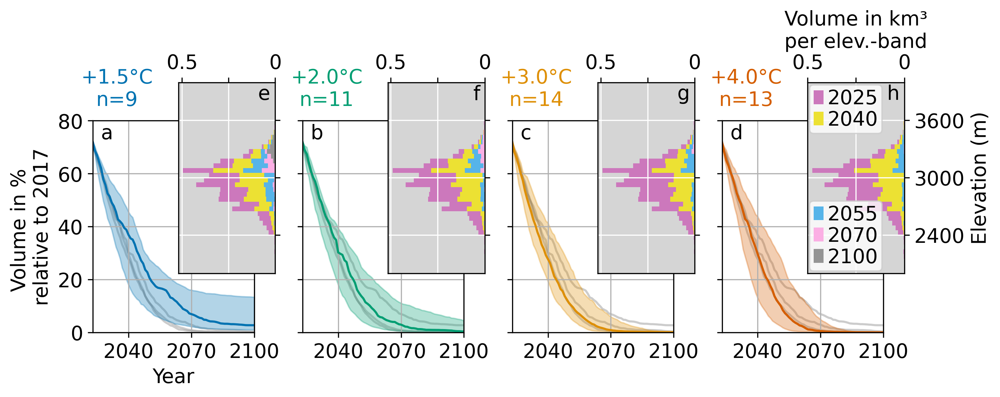

# OGGM Projections for Pitztal, Ötztal and Stubaital

This repository contains OGGM projections for Pitztal, Ötztal and Stubaital. It is work in progress and will be updated regularly to accompany an upcoming publication. We don't expect any change to the results before submission.

We used [OGGM v1.6.1](https://zenodo.org/badge/latestdoi/43965645) calibrated it with high resolution, regionally aquired data (Hartl et al., in prep) for the 1980-2023 period. For the projections (2023-2100) we used all available CMIP5 and CMIP6 climate projections, as described for the ['OGGM standard projections'](https://github.com/OGGM/oggm-standard-projections-csv-files). We aggregated these scenarios into global temperature increase levels +1.5°C, +2.0°C, +3.0°C and +4.0°C compared to preindustrial levels, following the methodology of [Rounce et al. (2023)](https://doi.org/10.1126/science.abo1324).

_Figure: Median (colored lines) and 5th and 95th percentile (shading) of the OGGM regional projections per future temperature scenario as percentage of 2023 glacier volume in the region of interest (a, b, c and d). The grey lines in each subplot show the median of the other three scenarios for reference. Temperature increase and number of climate model realizations n per scenario stated above the volume evolution plots. Insets (e, f, g and h) show the distribution of ice volume per 50 m elevation bands in different years for the four temperature scenarios, for the model run closest to the volume median of the scenario ensemble (colored lines). The shown models are +1.5°C INM-CM4-8 ssp126, +2.0°C NorESM2-MM ssp245, +3.0°C FGOALS-f3-L ssp245 and +4.0°C NorESM2-MM ssp585._

## Data availability

The repository contains ...
